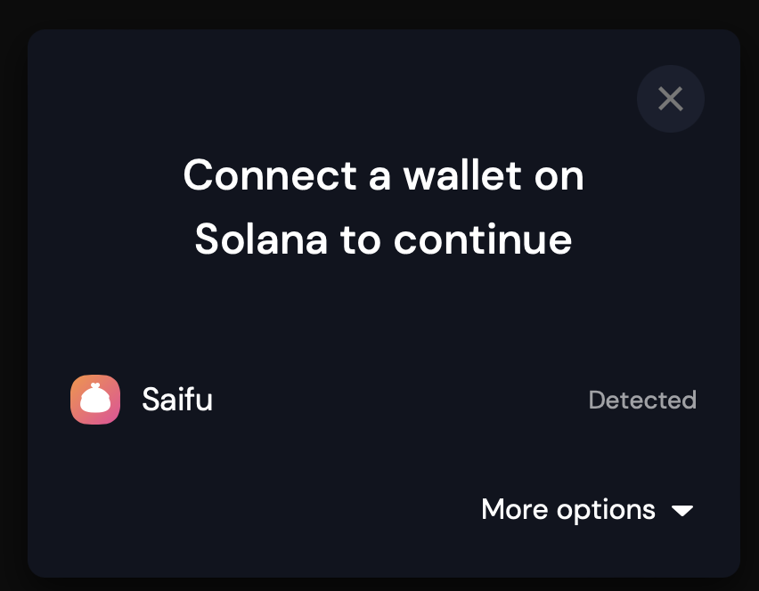

# `@saifuwallet/wallet-adapter`

Wallet adapter for integrating Saifu Wallet



Actual wallet adapter code is in https://github.com/saifuwallet/wallet-adapter/tree/master/packages/wallets/saifu

## Integrating saifu wallet-adapter

This is assuming you already use `@solana/wallet-adapter`

1. Install with `yarn add @saifuwallet/wallet-adapter` or `npm i @saifuwallet/wallet-adapter`
2. Add to your existing bootstrap

```typescript
import {SaifuWalletAdapter} from '@saifuwallet/wallet-adapter';

// ... import other stuff here

const wallets = useMemo(
    () => [
        new PhantomWalletAdapter(),
        new SlopeWalletAdapter(),
        new SaifuWalletAdapter(), // add to your wallets array
    ],
    [network]
);

// continue to use like always
return (
    <ConnectionProvider endpoint={endpoint}>
        <WalletProvider wallets={wallets} autoConnect>
            <WalletModalProvider>
                <WalletMultiButton />
                <WalletDisconnectButton />
            </WalletModalProvider>
        </WalletProvider>
    </ConnectionProvider>
);

```

3. Done!
